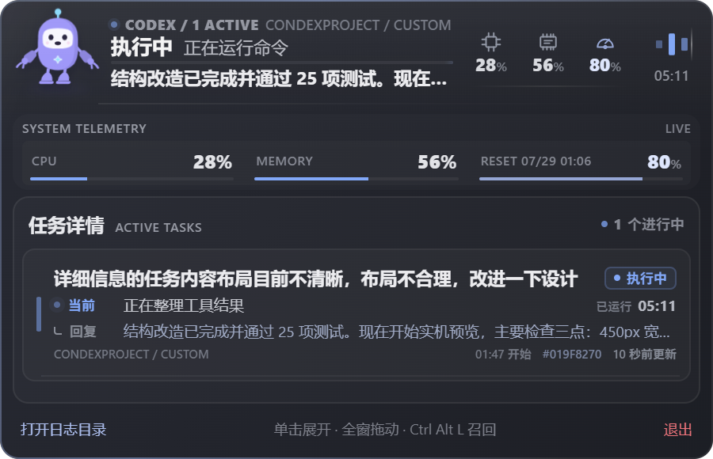

# Codex Lumo

Codex Lumo 是一个 Windows 桌面悬浮伴侣，用紧凑的灵动窗展示本机 Codex 任务、最近回复、运行状态、额度以及 CPU 和内存占用。



## 功能

- 自动读取本机 Codex 会话与任务事件，不上传日志。
- 展示所有正在运行的任务、当前动作、最近可见回复、工作区与运行时间。
- 只读关联 Codex 委派的 OpenCode 子任务，并按最新事件校准运行、完成与中断状态。
- 只有收到可见回复时才自动弹出，思考摘要和工具过程保持静默。
- 支持贴顶自动隐藏、全窗口拖动、双击打开 Codex 和托盘设置。
- 内置多状态宠物动画，并在隐藏时降低刷新和采样频率。
- 提供安装版与免安装便携版。

## 下载

从 [GitHub Releases](https://github.com/weihang-luo/codex-lumo/releases/latest) 下载最新版本：

- `Codex-Lumo-Setup-*-x64.exe`：Windows 安装版。
- `Codex-Lumo-Portable-*-x64.exe`：免安装便携版。

## 本地开发

需要 Node.js 22 或更高版本。

```powershell
cd desktop-app
npm install
npm test
npm start
```

构建 Windows 安装包：

```powershell
npm run dist
```

生成文件位于 `desktop-app/release/`。

## 隐私

桌面应用只读访问 `%USERPROFILE%\.codex\sessions` 和本机 Codex 日志数据库。任务解析、系统状态采样和界面渲染均在本机完成。

## 许可证

项目采用 [MIT License](LICENSE)。宠物形象改编自 MIT 许可的 React Kawaii `Cyborg`，第三方许可与来源见 `desktop-app/assets/pet/`。

## OpenCode 子任务

当 Codex 通过 `opencode run` 委派任务时，详情会把 OpenCode 会话显示为父 Codex 任务下的子任务，并展示运行阶段、最新进展、最新回复、模型、token 用量与耗时。关联以 Codex 调用 ID、启动时间、工作区和首条提示为依据；连续使用 `-c` 的调用会合并为同一子任务并标注轮次。

OpenCode 补全为本地只读功能，仅查询 `~/.local/share/opencode/opencode.db` 中的 `session`、`message` 和 `part` 表，不读取凭据表，也不会继续、终止或修改 OpenCode 会话。没有 OpenCode 子任务时不会轮询该数据库。

状态判断以当前轮次的最新 assistant 消息为准，并用较新的 Codex 终端退出事件修正 OpenCode 数据库中未及时落盘的状态。日志文本会先移除终端控制符，尝试修复可逆编码错误；包含不可恢复替换字符的工具输出不会显示在详情中。
